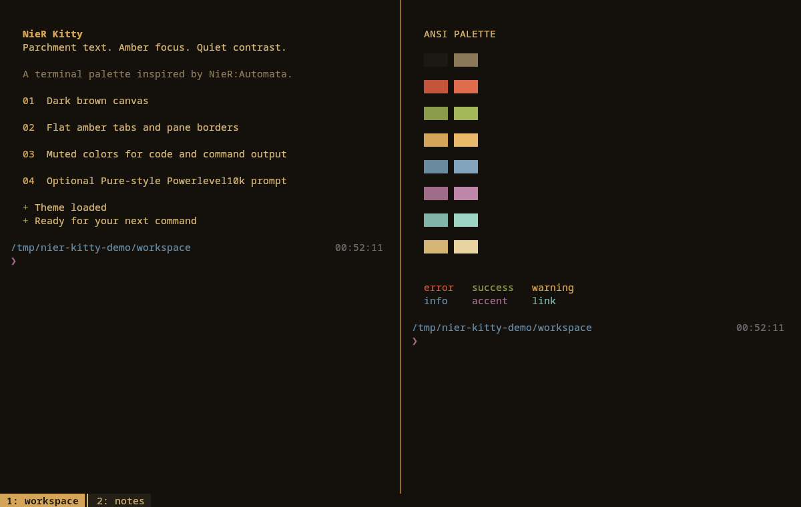

# NieR Kitty

A dark brown, parchment, and amber look for [Kitty](https://sw.kovidgoyal.net/kitty/), inspired by NieR:Automata. Muted ANSI colors keep errors, diffs, and syntax distinct; flat amber tabs and borders mark keyboard focus.



The theme works with any shell. The optional Zsh / Powerlevel10k preset adds a two-line Pure-style prompt, Git status, a 24-hour clock, and transient prompts.

## Install the Kitty theme

Install Kitty using your distribution's package manager, then clone this repository:

```sh
git clone https://github.com/PedroAmorimP/nier-kitty.git
cd nier-kitty
kitty_dir="${XDG_CONFIG_HOME:-$HOME/.config}/kitty"
mkdir -p "$kitty_dir"
```

If you use `KITTY_CONFIG_DIRECTORY` or `kitty --config`, set `kitty_dir` to your actual configuration directory instead. Downloading and extracting the GitHub ZIP also works; run the remaining commands from the extracted directory.

Back up any existing files before copying:

```sh
backup_stamp="$(date +%Y%m%d-%H%M%S)"
for file in kitty.conf nier.conf; do
  if [ -e "$kitty_dir/$file" ]; then
    cp -p "$kitty_dir/$file" "$kitty_dir/$file.backup-$backup_stamp"
  fi
done
cp kitty/nier.conf "$kitty_dir/nier.conf"
```

Add this line **once**, at the end of your existing `kitty.conf` (create that file if needed):

```conf
include nier.conf
```

Later settings override earlier ones, so put your own overrides after this include. If you use Kitty's theme picker afterward, check the ordering of its `current-theme.conf` include.

Press **Ctrl+Shift+F5** to reload, or open a new Kitty window. Tabs appear when two or more tabs are open; **Ctrl+Shift+T** opens another tab with Kitty's default shortcuts.

### Light variant

`kitty/tennoworth-light.conf` is a light paper-and-ink variant. Install it the same way, copying it to `"$kitty_dir/tennoworth-light.conf"` and using `include tennoworth-light.conf` instead of `include nier.conf`. Include only one of the two themes.

In the light variant, ANSI black is a paper tone so black-on-color badges (for example `ls` on `/tmp`) stay readable; plain black text is therefore very faint.

## Match the font

The original setup uses the system monospace selection, which resolves to **Noto Sans Mono** on the author's machine. Install that font separately to match it; no font files are bundled. Add after the theme include:

```conf
font_family Noto Sans Mono
```

The preview uses `font_size 11.0`. Font size is your choice; the theme does not set it. You can also use Kitty's [font chooser](https://sw.kovidgoyal.net/kitty/kittens/choose-fonts/). The supplied prompt hides segment icons, so it does not require a Nerd Font specifically; your font or fallback must cover its arrows and prompt symbols.

## Optional: the matching shell prompt

Requires Zsh and [Powerlevel10k](https://github.com/romkatv/powerlevel10k#installation). Install and load Powerlevel10k using its upstream instructions for your shell setup. Oh My Zsh and CachyOS are not required.

From this repository's directory:

```sh
prompt_dir="${XDG_CONFIG_HOME:-$HOME/.config}/nier-kitty"
mkdir -p "$prompt_dir"
if [ -e "$prompt_dir/p10k.zsh" ]; then
  cp -p "$prompt_dir/p10k.zsh" "$prompt_dir/p10k.zsh.backup-$(date +%Y%m%d-%H%M%S)"
fi
cp shell/p10k.zsh "$prompt_dir/p10k.zsh"
```

Back up your shell startup file (`${ZDOTDIR:-$HOME}/.zshrc`), then add this line **after Powerlevel10k loads**:

```zsh
source "${XDG_CONFIG_HOME:-$HOME/.config}/nier-kitty/p10k.zsh"
```

If you already source another Powerlevel10k preset, comment out that source line and use this one instead. Keep the old preset file for rollback. Open a new shell to see the result. Existing instant-prompt initialization can stay in place; see the [upstream instant-prompt guide](https://github.com/romkatv/powerlevel10k#instant-prompt) if enabling it for the first time.

This only supplies the prompt. Autosuggestions, syntax highlighting, aliases, and other shell plugins are independent and are not installed here.

## Customize

Put overrides after `include nier.conf`, for example:

```conf
# Show the tab bar even with a single tab.
tab_bar_min_tabs 1
# Give text more space around the edges.
window_padding_width 6
```

Pane border colors apply when you use multi-pane layouts. To try a split with a native Kitty shortcut, add:

```conf
enabled_layouts splits
map ctrl+shift+enter launch --location=vsplit --cwd=current
```

These optional lines select the splits layout and override that shortcut. See the [layouts guide](https://sw.kovidgoyal.net/kitty/layouts/) for other arrangements. The preview uses two panes, two tabs, and `window_padding_width 12`.

The theme sets terminal colors, faint-text opacity, the extended 256-color palette, numbered tab titles, tab visibility, and border width. It does not change your shell, keyboard shortcuts, layouts, or workspace commands. Desktop decorations are controlled by your window manager.

### Apps with their own colors

Some tools send exact RGB colors and ignore the terminal palette; bat's default theme is one. To make them follow the theme, add to your shell startup file:

```sh
# bat, and delta, which uses bat's themes
export BAT_THEME=ansi
# fzf: use the 16 theme colors
export FZF_DEFAULT_OPTS="--color=16"
```

Editors such as Neovim with `termguicolors` also use their own colorscheme.

`assets/theme-improvements.html` compares real tool output (git, gcc, rustc, ls, Python) under the previous and current palettes.

## Update or remove

To update, run `git pull --ff-only` in your clone, back up the installed files as above, and copy the theme and optional prompt again. Do not add duplicate include/source lines. Local edits to installed copies will be replaced, so keep Kitty overrides in `kitty.conf` after the include.

To remove the theme, remove `include nier.conf` from `kitty.conf`, remove any font or appearance overrides you added, then reload Kitty. Delete the installed `nier.conf` only after removing its include. If it replaced a pre-existing file, restore that file from your backup instead.

To remove the optional prompt, remove its source line from `.zshrc`, restore your previous prompt source line, and open a new shell. You can then delete the installed `nier-kitty/p10k.zsh` or restore its previous version from backup. Keep backups until you are satisfied with the result.

## Compatibility and credits

Verified on Linux with Kitty 0.49.1 and Zsh / Powerlevel10k. `palette_generate` requires Kitty 0.47 or newer; older versions warn about the unknown option and keep the default 256-color palette. macOS is untested. Refer to [Kitty's configuration reference](https://sw.kovidgoyal.net/kitty/conf/) for configuration paths and platform-specific reload shortcuts.

The palette was adapted from the author's local NieR-inspired Konsole and KDE color schemes, with a brighter ANSI bright-black for readable comments. This is an unofficial fan-made terminal theme; no game artwork or fonts are included.

Original work is [MIT licensed](LICENSE). The optional prompt derives from Powerlevel10k's `p10k-pure.zsh` preset, inspired by [Pure](https://github.com/sindresorhus/pure); its upstream MIT notice is retained in [licenses/powerlevel10k.txt](licenses/powerlevel10k.txt).
