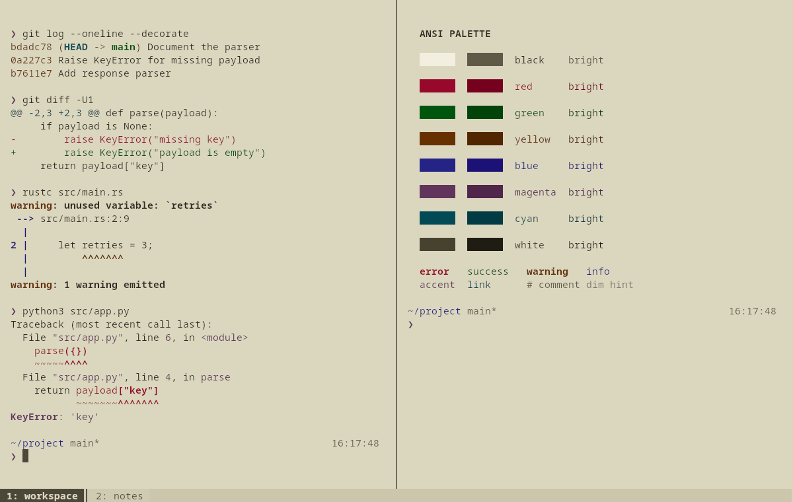
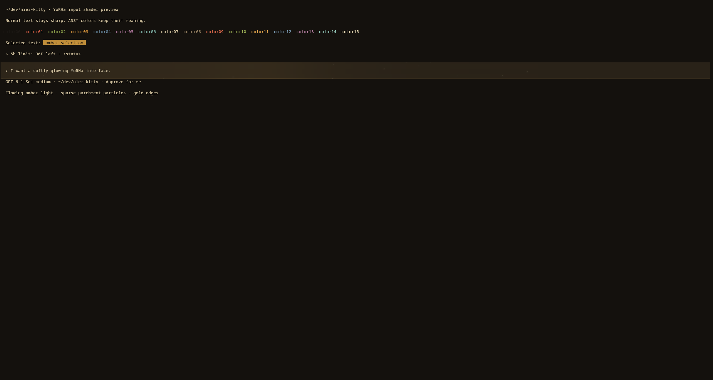
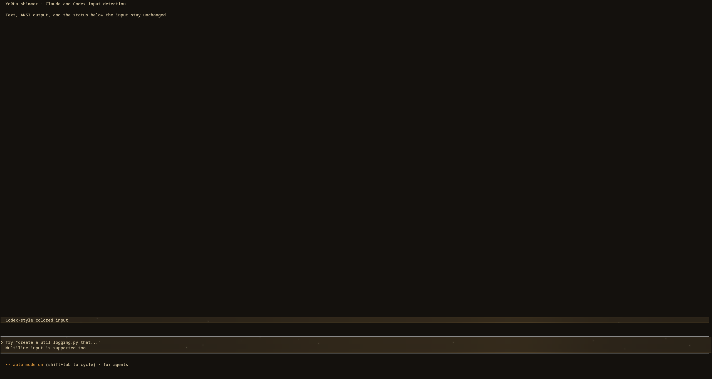

# NieR Kitty

Two [Kitty](https://sw.kovidgoyal.net/kitty/) themes inspired by NieR:Automata: a dark brown, parchment, and amber theme, and a light paper-and-ink variant. Both are tuned for the output you read every day: Git hashes and diffs, compiler warnings and errors, tracebacks, and dim hint text each stay distinct from normal text. Flat tabs and pane borders mark keyboard focus.

Choose the **clean theme** for the original appearance, or add the **optional YoRHa shader** to the dark theme for flowing amber light and sparkles in supported terminal input panels.

| Version | Configuration | Requirements |
| --- | --- | --- |
| Clean dark | `include nier.conf` | Kitty; 0.47+ for the generated palette |
| Clean light | `include tennoworth-light.conf` | Kitty; 0.47+ for the generated palette |
| Dark with YoRHa shimmer | `include nier.conf`, then `include yorha-input.conf` | Kitty 0.49+, shader-slang, and the supplied shader files |

The standard installation below installs a clean theme. Follow [the shader installation](#optional-animated-yorha-input-shimmer) to add the animated version.




The themes work with any shell. The optional Zsh / Powerlevel10k preset adds the two-line Pure-style prompt shown above, with Git status, a 24-hour clock, and transient prompts. An optional [pi](https://pi.dev) harness theme keeps that agent on the dark theme's amber accents instead of its own violet ones.

## What the themes set

- **Distinct semantic colors.** Yellow output (Git hashes, warnings, quoted strings) no longer blends into body text, and errors and warnings meet 4.5:1 contrast. The light variant's six colors are chosen together so each pair stays easy to tell apart.
- **Readable faint text.** `dim_opacity` keeps hints, timings, and secondary output legible.
- **Themed 256-color palette.** `palette_generate semantic` derives colors 16–255 from the theme, so tools that use the extended palette (prompt grays, editor cursor lines) match it.
- **Terminal chrome.** Selection, cursor, Kitty marks, numbered tabs, and pane borders.

`assets/theme-improvements.html` compares real tool output (git, gcc, rustc, ls, Python) under the previous and current palettes, with measured contrast for each change.

## Install a Kitty theme

Install Kitty using your distribution's package manager, then clone this repository and choose a theme:

```sh
git clone https://github.com/PedroAmorimP/nier-kitty.git
cd nier-kitty
kitty_dir="${XDG_CONFIG_HOME:-$HOME/.config}/kitty"
mkdir -p "$kitty_dir"
theme=nier.conf  # or tennoworth-light.conf for the light variant
```

If you use `KITTY_CONFIG_DIRECTORY` or `kitty --config`, set `kitty_dir` to your actual configuration directory instead. Downloading and extracting the GitHub ZIP also works; run the remaining commands from the extracted directory.

Back up any existing files before copying:

```sh
backup_stamp="$(date +%Y%m%d-%H%M%S)"
for file in kitty.conf "$theme"; do
  if [ -e "$kitty_dir/$file" ]; then
    cp -p "$kitty_dir/$file" "$kitty_dir/$file.backup-$backup_stamp"
  fi
done
cp "kitty/$theme" "$kitty_dir/$theme"
```

Add **one** include line at the end of your existing `kitty.conf` (create that file if needed):

```conf
include nier.conf
```

For the light variant, use `include tennoworth-light.conf` instead. Include only one theme. Later settings override earlier ones, so put your own overrides after the include. If you use Kitty's theme picker afterward, check the ordering of its `current-theme.conf` include.

Press **Ctrl+Shift+F5** to reload, or open a new Kitty window. Tabs appear when two or more tabs are open; **Ctrl+Shift+T** opens another tab with Kitty's default shortcuts.

In the light variant, ANSI black is a paper tone so black-on-color badges (for example `ls` on `/tmp`) stay readable; plain black text is therefore very faint. White stays a readable ink, so white-on-red badges (for example `ls` on setuid files) are hard to read.

## Match the font

The screenshots use **Noto Sans Mono** at `font_size 11.0`. Install that font separately to match them; no font files are bundled. Add after the theme include:

```conf
font_family Noto Sans Mono
```

Font size is your choice; the theme does not set it. You can also use Kitty's [font chooser](https://sw.kovidgoyal.net/kitty/kittens/choose-fonts/). The supplied prompt hides segment icons, so it does not require a Nerd Font specifically; your font or fallback must cover its arrows and prompt symbols.

## Optional: the matching shell prompt

Requires Zsh and [Powerlevel10k](https://github.com/romkatv/powerlevel10k#installation). Install and load Powerlevel10k using its upstream instructions for your shell setup. Oh My Zsh and CachyOS are not required. The prompt uses ANSI colors, so it follows whichever theme you include.

From this repository's directory:

```sh
prompt_dir="${XDG_CONFIG_HOME:-$HOME/.config}/nier-kitty"
mkdir -p "$prompt_dir"
if [ -e "$prompt_dir/p10k.zsh" ]; then
  cp -p "$prompt_dir/p10k.zsh" "$prompt_dir/p10k.zsh.backup-$(date +%Y%m%d-%H%M%S)"
fi
cp shell/p10k.zsh "$prompt_dir/p10k.zsh"
```

Back up your shell startup file (`${ZDOTDIR:-$HOME}/.zshrc`), then add this line **after Powerlevel10k loads**:

```zsh
source "${XDG_CONFIG_HOME:-$HOME/.config}/nier-kitty/p10k.zsh"
```

If you already source another Powerlevel10k preset, comment out that source line and use this one instead. Keep the old preset file for rollback. Open a new shell to see the result. Existing instant-prompt initialization can stay in place; see the [upstream instant-prompt guide](https://github.com/romkatv/powerlevel10k#instant-prompt) if enabling it for the first time.

This only supplies the prompt. Autosuggestions, syntax highlighting, aliases, and other shell plugins are independent and are not installed here.

## Optional: the matching pi harness theme

[pi](https://pi.dev) builds its default `system` theme from the terminal palette, so NieR's muted ANSI magenta becomes pi's violet accents: the footer's model label, inline code, syntax types, and the input-box border that tracks the thinking level. `pi/nier.json` keeps the palette pi generates for this theme and moves only those tokens to the dark theme's amber accents. The `system` theme is untouched if you skip it.

From this repository's directory:

```sh
pi_dir="${PI_CODING_AGENT_DIR:-$HOME/.pi/agent}/themes"
mkdir -p "$pi_dir"
cp pi/nier.json "$pi_dir/"
```

Run `/reload` in pi, then choose **nier** under `/settings` → **Theme**. Choose **system** again to go back. The file is a snapshot of the colors pi generates for this palette, so edit its `vars` to retune the accents. Its input-box border is the same rule pair the [YoRHa shimmer](#optional-animated-yorha-input-shimmer) detects. The light variant is not covered.

## Customize

Put overrides after the theme include, for example:

```conf
# Show the tab bar even with a single tab.
tab_bar_min_tabs 1
# Give text more space around the edges.
window_padding_width 6
```

Pane border colors apply when you use multi-pane layouts. To try a split with a native Kitty shortcut, add:

```conf
enabled_layouts splits
map ctrl+shift+enter launch --location=vsplit --cwd=current
```

These optional lines select the splits layout and override that shortcut. See the [layouts guide](https://sw.kovidgoyal.net/kitty/layouts/) for other arrangements. The screenshots use two panes, two tabs, and `window_padding_width 12`.

The themes do not change your shell, keyboard shortcuts, layouts, or workspace commands. Desktop decorations are controlled by your window manager.

### Apps with their own colors

Some tools send exact RGB colors and ignore the terminal palette; bat's default theme is one. To make them follow the theme, add to your shell startup file:

```sh
# bat, and delta, which uses bat's themes
export BAT_THEME=ansi
# fzf: use the 16 theme colors
export FZF_DEFAULT_OPTS="--color=16"
```

Editors such as Neovim with `termguicolors` also use their own colorscheme.

### Optional: animated YoRHa input shimmer

The dark theme has an optional bronze input treatment with flowing amber light, sparse parchment particles, faint scanlines, and a fine gold edge. Open `assets/yorha-input-mockup.html` in a browser to explore the design.



This uses [Kitty custom shaders](https://sw.kovidgoyal.net/kitty/custom-shaders/) and requires Kitty **0.49 or newer** plus the **shader-slang** compiler (`slangc`). On Arch/CachyOS, install the compiler with `sudo pacman -S shader-slang`.

From the repository directory, using the same `kitty_dir` as above:

```sh
mkdir -p "$kitty_dir/shaders"
backup_stamp="$(date +%Y%m%d-%H%M%S)"
for file in yorha-input.conf shaders/yorha-input.pipeline shaders/yorha-input.slang shaders/yorha-panel-mask.slang; do
  if [ -e "$kitty_dir/$file" ]; then
    cp -p "$kitty_dir/$file" "$kitty_dir/$file.backup-$backup_stamp"
  fi
done
cp kitty/yorha-input.conf "$kitty_dir/"
cp kitty/shaders/yorha-input.pipeline kitty/shaders/yorha-input.slang kitty/shaders/yorha-panel-mask.slang "$kitty_dir/shaders/"
```

After copying the shader files, the animated version uses these two includes in `kitty.conf`, in this order:

```conf
include nier.conf
include yorha-input.conf
```

Reload with **Ctrl+Shift+F5**. The pipeline requests a frame every 50 ms (20 fps) and keeps the treatment visible across focus changes. Remove the include and reload to disable it. If you already use `custom_shaders`, combine shader names in one setting; later settings replace earlier ones.

The shared shader recognizes three input styles inside the active pane:

- **Colored panels**, such as the Codex reference's **`#302d2a`** background.
- **Neutral ruled panels**, such as the supplied Claude reference: the terminal background between two long neutral gray horizontal lines near the bottom of the pane.
- **Tinted ruled panels**, as the pi TUI draws them: the same rule pair in the application's own border color, which here shifts with its mode (violet at higher thinking levels, green in bash mode). Both rules must share one color.

A narrow scratch pass detects either kind of ruled panel once per screen row. Text and the horizontal rules retain their colors; matching background pixels between the rules receive the effect.



These are visual heuristics, not application-aware input detection. Other regions with the same color or pair of rules can match. Ruled panels must be within the bottom 320 physical pixels, with borders 12–192 physical pixels apart; large multiline inputs or different UI styles may not match. Codex and Claude were previewed in Kitty and confirmed by the author in their terminal apps; the pi TUI input panel was verified with pi 1.0.4 on Kitty 0.49.2; Gemini has not been validated. Transparent windows and the light theme are not supported. The shader does not move or resize the application's input field.

Adjust `INTENSITY` (default `0.6`), `SPEED` (default `1.0`), `PARTICLE_DENSITY` (default `0.28`), `SPARKLE_BRIGHTNESS` (default `0.12`), or `INPUT_RGB` in `shaders/yorha-input.slang`, then reload. Set `DETECT_RULED_PANELS` to `false` in `shaders/yorha-panel-mask.slang` to disable ruled-panel detection, or `DETECT_TINTED_RULES` to `false` to keep only neutral gray rules. For a static effect, set `SPEED` to `0.0` and set both `animation_step` entries to `0` in the pipeline.

For a sparklier look, try `INTENSITY = 1.0`, `PARTICLE_DENSITY = 0.55`, and `SPARKLE_BRIGHTNESS = 0.25`. The density and brightness settings affect particles; intensity also brightens the flowing light. Edit the installed shader, then reload Kitty.

## Update or remove

To update, run `git pull --ff-only` in your clone, back up the installed files as above, and copy the theme, the optional prompt, and the pi theme again. Do not add duplicate include/source lines. Local edits to installed copies will be replaced, so keep Kitty overrides in `kitty.conf` after the include.

If you use the shader version, also repeat the shader backup and copy commands. Preserve any custom shader constants before updating: copying the supplied shaders restores their defaults.

To return to the clean dark theme, remove only `include yorha-input.conf` and reload Kitty. Keep `include nier.conf`. Once the effect is disabled, you may delete `yorha-input.conf`, `shaders/yorha-input.pipeline`, `shaders/yorha-input.slang`, and `shaders/yorha-panel-mask.slang` from the Kitty configuration directory.

To remove a theme, remove its include line from `kitty.conf`, remove any font or appearance overrides you added, then reload Kitty. Delete the installed theme file only after removing its include. If it replaced a pre-existing file, restore that file from your backup instead.

To remove the optional prompt, remove its source line from `.zshrc`, restore your previous prompt source line, and open a new shell. You can then delete the installed `nier-kitty/p10k.zsh` or restore its previous version from backup. Keep backups until you are satisfied with the result.

To remove the pi theme, choose **system** in pi's `/settings` and delete the copied `themes/nier.json`.

## Compatibility and credits

Verified on Linux with Kitty 0.49.1 and Zsh / Powerlevel10k; the pi theme matches pi 1.0.4's theme schema. `palette_generate` requires Kitty 0.47 or newer; older versions warn about the unknown option and keep the default 256-color palette. macOS is untested. Refer to [Kitty's configuration reference](https://sw.kovidgoyal.net/kitty/conf/) for configuration paths and platform-specific reload shortcuts.

The dark palette was adapted from the author's local NieR-inspired Konsole and KDE color schemes. The light variant uses the paper and ink tones of the author's Tennoworth YoRHa light theme. This is an unofficial fan-made terminal theme; no game artwork or fonts are included.

Original work is [MIT licensed](LICENSE). The optional prompt derives from Powerlevel10k's `p10k-pure.zsh` preset, inspired by [Pure](https://github.com/sindresorhus/pure); its upstream MIT notice is retained in [licenses/powerlevel10k.txt](licenses/powerlevel10k.txt). The pi theme holds color values from pi's own `system` theme generator for this palette; pi is MIT licensed.
